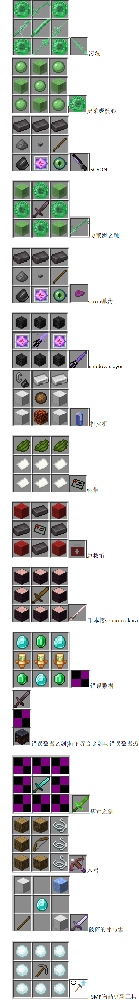

合成表
=

<!DOCTYPE html>
<html lang="en">
<head>
    <meta charset="UTF-8">
    <meta name="viewport" content="width=device-width, initial-scale=1.0">
    <title>所有合成表</title>
</head>
<body>
    
</body>
</html>

> 🔨 此页面的内容即将被拆分至单独物品的页面  
> 注: 若在此无法找到某个物品的合成表,请前往它的页面查找
 

 