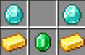

恼冠
=

<!DOCTYPE html>
<html lang="zh">
<head>
    <title>恼冠</title>
</head>
恼冠是一个BOSS召唤物品,将其仍在恼鬼身上即可使其变为
<a href="../vex_king">恼鬼王</a>
 
<body>
    
    
</body> 
</html>

###获取方式
在FSMP工作台摆放:

###你知道吗

- 其实恼冠是把木剑,但其攻击力属性为-99999 因此无法使用恼冠攻击